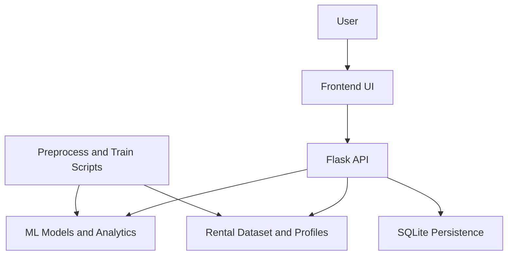

# System Architecture: UrbanMove

## High-Level Overview

UrbanMove follows a layered architecture that separates the user interface, API logic, machine learning, and persistence components. This keeps the prediction workflow fast while allowing data preparation and retraining to happen independently.

## Layer Breakdown

### 1. Frontend Layer

- Built with HTML, CSS, and Vanilla JavaScript.
- Renders the dashboard, map, rent analytics form, compare cards, scorecards, and feedback panels.
- Uses Chart.js for charts and Leaflet for map exploration.

### 2. Backend API Layer

- Built with Flask and Flask-CORS.
- Serves the single-page UI and exposes JSON endpoints for analytics, predictions, recommendations, and persistence.
- Handles request validation, model inference, feature aggregation, and response shaping for the frontend.

### 3. ML and Analytics Layer

- Random Forest Regressor predicts rent from property and location attributes.
- K-Means clusters listings for map and locality grouping.
- Additional analytics logic computes market position, trend forecasts, locality scores, commute fit, and budget guidance.

### 4. Data Layer

- Main dataset: `Cleaned_House_Rent_Dataset.csv`
- Locality profile enrichment: `data/locality_profiles.csv`
- Model artifacts: `model_artifacts/`
- The dataset also carries listing freshness dates used in the current UI.

### 5. Persistence Layer

- SQLite database in `instance/urbanmove.sqlite3`
- Stores:
  - saved searches
  - shortlist items
  - prediction feedback

## Main Runtime Flow

1. The frontend collects user input in Rent Analytics.
2. The request is sent to Flask API endpoints such as `/api/predict`.
3. The backend loads the required model and supporting data.
4. Prediction and analytics responses are returned as JSON.
5. The frontend updates cards for rent estimate, budget position, locality matches, trends, and related actions.
6. User actions such as save search, shortlist, and feedback are stored in SQLite.

## Offline Pipeline Flow

1. `scripts/preprocess_data.py` prepares cleaned input data.
2. `scripts/train_models.py` regenerates EDA outputs, clustering outputs, and trained model artifacts.
3. The Flask app reads the latest artifacts at runtime.

## Design Rationale

- CSV plus model artifacts keep the project lightweight for academic deployment.
- SQLite is sufficient for local persistence without introducing server complexity.
- Separate scripts for preprocessing and training keep the runtime app simpler and easier to explain during review.
