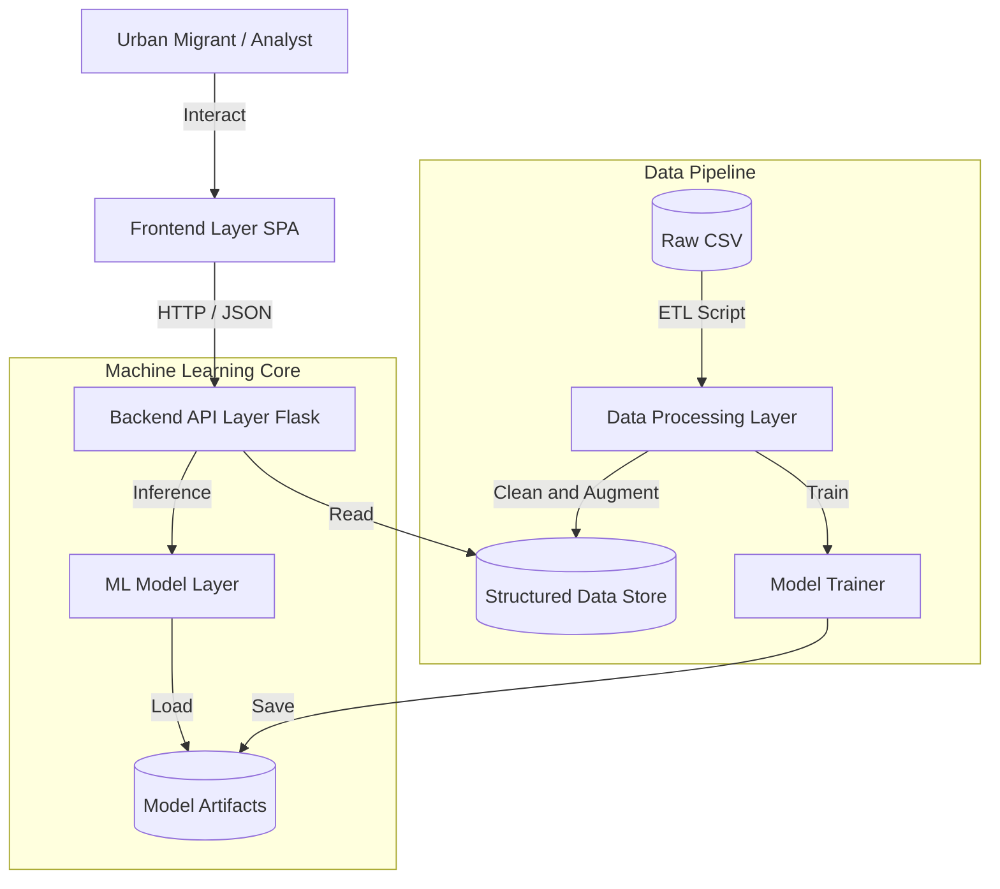
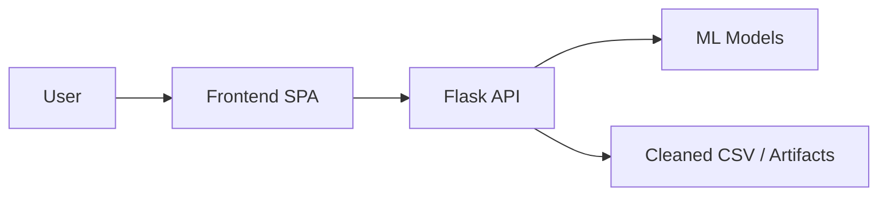

# Diagram Export Instructions — Slide 4 (Architecture)

Use this to create the **High-Level Architecture** visual for your PPT. The diagram shows: User → Frontend → API → ML Layer + Data Pipeline.

---

## Option 1: Mermaid Live Editor (easiest)

1. Go to **https://mermaid.live**
2. Paste the Mermaid code below into the left panel.
3. The diagram appears on the right.
4. Use **Actions → Export** (or **Download**) to save as **PNG** or **SVG**.
5. Insert the exported image into Slide 4 of your PowerPoint or Google Slides.

---

## Option 2: VS Code / Cursor

1. Install the **Mermaid** extension (e.g., "Mermaid Preview" or "Markdown Preview Mermaid Support").
2. Create a `.md` file and add a fenced code block with `mermaid` and the code below.
3. Open preview; right-click the diagram to copy or use an export extension to save as PNG/SVG.

---

## Option 3: Command line (Mermaid CLI)

If you have Node.js and `@mermaid-js/mermaid-cli` installed:

```bash
# Install (one-time)
npm install -g @mermaid-js/mermaid-cli

# Save the Mermaid code below to a file, e.g. architecture.mmd, then:
mmdc -i architecture.mmd -o architecture.png
# or for SVG:
mmdc -i architecture.mmd -o architecture.svg
```

---

## Mermaid code (full architecture from ARCHITECTURE.md)

Copy everything between the triple backticks into Mermaid Live or your `.mmd` file.



**Note:** Some renderers are strict about subgraph IDs. If you get errors, use the simplified version below.

---

## Simplified Mermaid (if the above fails)



Use this for a minimal flow; export the same way (Mermaid Live → Export PNG/SVG).

---

## Caption for Slide 4

**Service-Oriented Architecture: Frontend (SPA) ↔ Flask API ↔ ML models & file-based data.**
